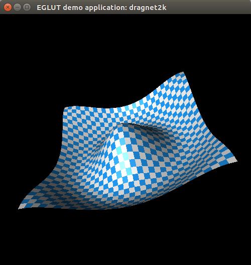

Readme file for the EGLUT edragnet program
==========================================

The 'edragnet' program is a translation of the GLUT C program 'dragnet2k' to an EGLUT Eiffel program. The original 'dragnet2k' program was written by Roger Wetzel. The original C program can be found at http://csclab.murraystate.edu/bob.pilgrim/515/lectures_04.html.



To compile and run
------------------

To compile:

```
$ make edragnet
```

To run:

```
$ ./edragnet
```

Note: The file 'ise5.ace' is the old EiffelStudio build configuration file and 'build.eant' is a Gobo Eiffel build config file not currently used. 

Exercises
---------

 1. Change the colors of the sheet.
