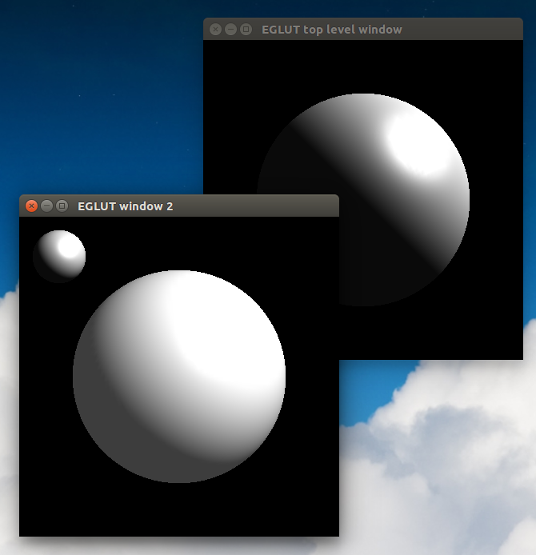

Readme file for the EGLUT multi_sphere program
==============================================

The 'multi_sphere' program is a translation and modification of the GLUT C program 'sphere.c' and displays two different GLUT windows, one with a single lit sphere and the other with two lit spheres. The original 'sphere.c' program can be found at https://www.opengl.org/archives/resources/code/samples/glut_examples/examples/examples.html.



To compile and run
------------------

To compile:

```
$ make multi_sphere
```

To run:

```
$ ./multi_sphere
```

Note: The file 'ise5.ace' is the old EiffelStudio build configuration file and 'build.eant' is a Gobo Eiffel build config file not currently used.

Exercises
---------

 1. Change the colors of the spheres and the lighting angles.
