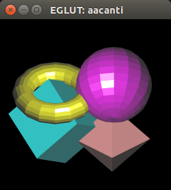
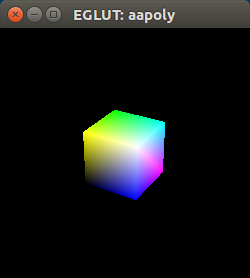
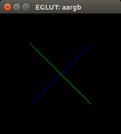
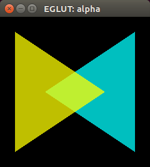
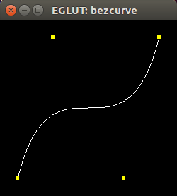
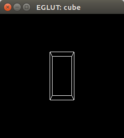

The Red Book example programs
=============================

The book *The OpenGL Programming Guide:  The Official Guide to Learning OpenGL, Version 4.3 (8th Edition)* is known as *The Red Book*. It was first published in 1996 and has since then been updated a number of times since then. It contains a number of OpenGL example programs. I have translated a number of the programs to Eiffel so they can be compiled with EiffelOpenGL and EGLUT. They are based on the C programs in the 3rd edition of The Red Book. Later editions of the book use C++ and I don't know if all original C programs have been translated to C++ and still are in the book.

All these Eiffel programs were originally written between 2000 and 2002. Currently I'm working on adapting them to work with EiffelStudio 16.05 and making sure EGLUT works with FreeGLUT.

Status can be one of **completed** (compiles and no warnings), **working** (compiles but has warnings), **ongoing**, **todo** and **wontfix**.

| *Program* | *Screenshot* | *Status* | *Eiffel conformance* | *Comment* |
| --------- | ------------ | -------- | -------------------- | --------- |
| aacanti   |  | **working** | Not Void-safe. | 9 obsolete calls. |
| aaindex   |  | **working (maybe!)** | Not Void-safe. | Compiles but does not run on any of my machines due to the lack of support for FB/index in my OpenGL implementation. 9 obsolete calls. |
| aapoly    |   | **working** | Not Void-safe. | 20 obsolete calls. |
| aargb     |   | **working** | Not Void-safe. | 9 obsolete calls. |
| alpha     |   | **working** | Not Void-safe. | 9 obsolete calls. |
| alpha3d   |   | **working** | Not Void-safe. | 9 obsolete calls. |
| bezcurve  |   | **working** | Not Void-safe. | 9 obsolete calls. |
| cube      |   | **working** | Not Void-safe. | 6 obsolete calls. |
| drawf     |  | **todo** |  |  |
| font      |  | **todo** |  |  |
| light     |  | **todo** |  |  |
| lines     |  | **todo** |  |  |
| planet    |  | **todo** |  |  |
| surface   |  | **todo** |  |  |
| teapots   |  | **todo** |  |  |
| torus     |  | **todo** |  |  |
