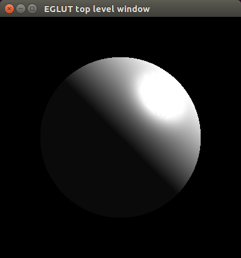

Readme file for the EGLUT single_sphere program
===============================================

The 'single_sphere' program is a translation of the GLUT C program 'sphere.c' which displays a lit sphere. The original 'sphere.c' program can be found at ihttps://www.opengl.org/archives/resources/code/samples/glut_examples/examples/examples.html.



To compile and run
------------------

To compile:

```
$ make single_sphere
```

To run:

```
$ ./single_sphere
```

Note: The file 'ise5.ace' is the old EiffelStudio build configuration file and 'build.eant' is a Gobo Eiffel build config file not currently used. 

Exercises
---------

 1. Change the color of the sphere and the lighting angle.
